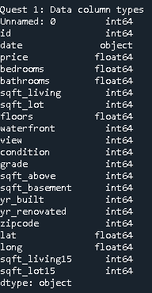
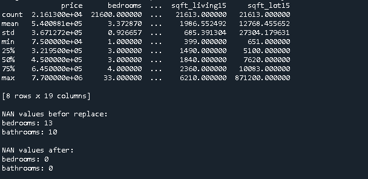
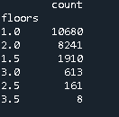
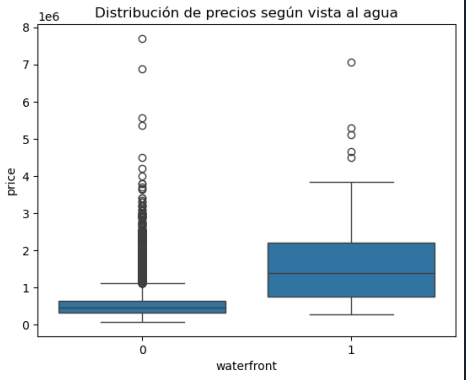
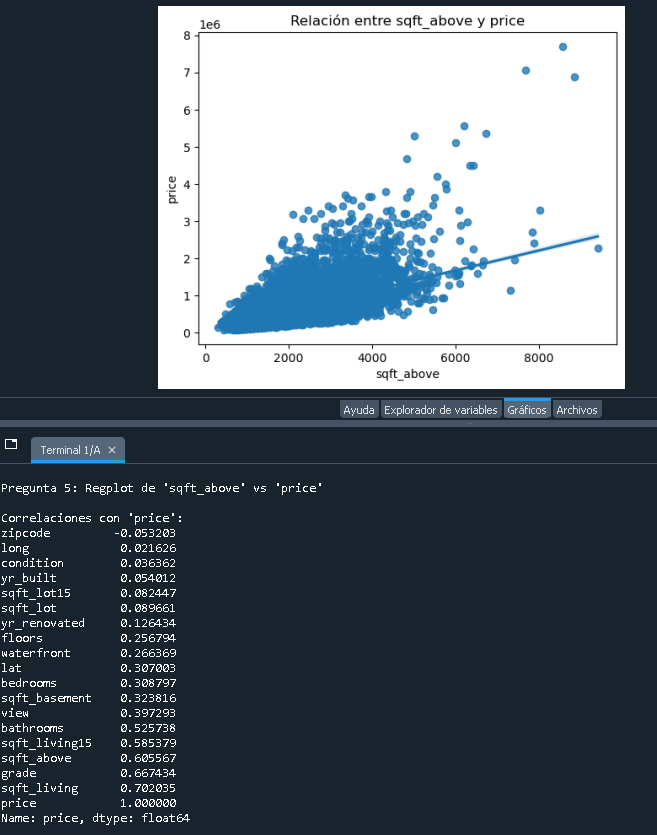
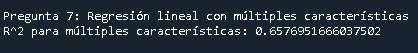
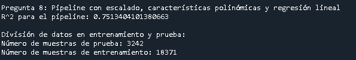
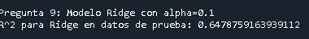
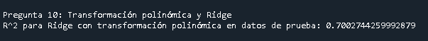

# Final Project - DATA ANALYSIS


## Question 1
```python
print("\nQuest 1: Data column types")
print(df.dtypes)
````
    



## Question 2
```python
df.drop(["id", "Unnamed: 0"], axis=1, inplace=True)
print("\nPregunta 2: Resumen estadístico después de eliminar columnas 'id' y 'Unnamed: 0'")
print(df.describe())

# Manejar valores faltantes en las columnas "bedrooms" y "bathrooms"
print("\nNAN values befor replace:")
print("bedrooms:", df['bedrooms'].isnull().sum())
print("bathrooms:", df['bathrooms'].isnull().sum())

mean_bedrooms = df['bedrooms'].mean()
df['bedrooms'].replace(np.nan, mean_bedrooms, inplace=True)
mean_bathrooms = df['bathrooms'].mean()
df['bathrooms'].replace(np.nan, mean_bathrooms, inplace=True)

print("\nNAN values after:")
print("bedrooms:", df['bedrooms'].isnull().sum())
print("bathrooms:", df['bathrooms'].isnull().sum())
````
                 



## Question 3 

```python
print("\nPregunta 3: Conteo de casas por número de pisos")
floor_counts = df['floors'].value_counts().to_frame()
print(floor_counts)
````



## Quesiton 4
```python
print("\nPregunta 4: Boxplot de precios según vista al agua")
sns.boxplot(x="waterfront", y="price", data=df)
plt.title("Distribución de precios según vista al agua")
plt.show()

````


# Question 5
```python
print("\nPregunta 5: Regplot de 'sqft_above' vs 'price'")
sns.regplot(x="sqft_above", y="price", data=df)
plt.title("Relación entre sqft_above y price")
plt.show()

# Mostrar correlaciones con "price" (adicional)
print("\nCorrelaciones con 'price':")
df_numeric = df.select_dtypes(include=[np.number])
print(df_numeric.corr()['price'].sort_values())

````



# Question 6
```python
print("\nPregunta 6: Regresión lineal con 'sqft_living'")
X = df[['sqft_living']]
Y = df['price']
lm = LinearRegression()
lm.fit(X, Y)
r2_sqft_living = lm.score(X, Y)
print("R^2 para 'sqft_living':", r2_sqft_living)
````


# Quesiton 7
```python
features = ["floors", "waterfront", "lat", "bedrooms", "sqft_basement", "view", "bathrooms", "sqft_living15", "sqft_above", "grade", "sqft_living"]
print("\nPregunta 7: Regresión lineal con múltiples características")
X = df[features]
Y = df['price']
lm.fit(X, Y)
r2_multi = lm.score(X, Y)
print("R^2 para múltiples características:", r2_multi)
````

 # Quesiton 8
```python
print("\nPregunta 8: Pipeline con escalado, características polinómicas y regresión lineal")
Input = [('scale', StandardScaler()), ('polynomial', PolynomialFeatures(include_bias=False)), ('model', LinearRegression())]
pipe = Pipeline(Input)
pipe.fit(X, Y)
r2_pipeline = pipe.score(X, Y)
print("R^2 para el pipeline:", r2_pipeline)

# Dividir los datos en conjuntos de entrenamiento y prueba
print("\nDivisión de datos en entrenamiento y prueba:")
x_train, x_test, y_train, y_test = train_test_split(X, Y, test_size=0.15, random_state=1)
print("Número de muestras de prueba:", x_test.shape[0])
print("Número de muestras de entrenamiento:", x_train.shape[0])

````


 # Quesiton 9
```python
print("\nPregunta 9: Modelo Ridge con alpha=0.1")
ridge = Ridge(alpha=0.1)
ridge.fit(x_train, y_train)
r2_ridge = ridge.score(x_test, y_test)
print("R^2 para Ridge en datos de prueba:", r2_ridge)

````


 # Quesiton 10
```python
print("\nPregunta 10: Transformación polinómica y Ridge")
poly = PolynomialFeatures(degree=2)
x_train_poly = poly.fit_transform(x_train)
x_test_poly = poly.transform(x_test)
ridge.fit(x_train_poly, y_train)
r2_poly_ridge = ridge.score(x_test_poly, y_test)
print("R^2 para Ridge con transformación polinómica en datos de prueba:", r2_poly_ridge)

````

